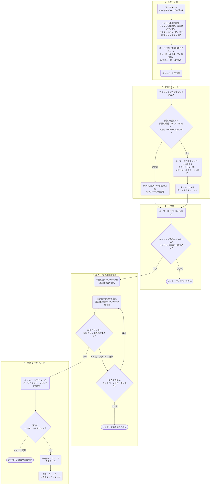

この記事では、MoEngageにおけるIn-Appキャンペーンの配信の仕組みについて説明します。これにより、メッセージがいつ表示されるかを予測し、表示されなかった理由を診断できます。配信に影響するキャンペーン設定、ユーザーとそのデバイスが満たす必要のある条件、およびこのチャネルが依存するSDK統合について説明します。

## 概要

In-Appメッセージは、ダッシュボードでの設定からデバイス上でのレンダリングまで、4つの段階を経てユーザーに届きます。

<Steps>
  <Step title="キャンペーンの設定">
    キャンペーン作成時に設定するルールです。トリガー条件、セグメント、コントロールグループ、優先度、配信コントロールが含まれます。
  </Step>
  <Step title="対象判定と取得">
    アプリが開かれると、MoEngageはユーザーが対象となるキャンペーンを判定し、SDKがそれらを取得してセッション用にキャッシュします。
  </Step>
  <Step title="トリガーと選択">
    ユーザーがトリガーアクションを実行すると、SDKはキャッシュされたキャンペーンをトリガーと画面で照合し、配信コントロールを適用して、優先度に基づいて1つを選択します。
  </Step>
  <Step title="表示とトラッキング">
    SDKはキャンペーンのアセットを取得し、正しく統合されたデバイスにメッセージを表示して、表示、クリック、非表示のイベントをトラッキングします。
  </Step>
</Steps>

## キャンペーンの設定

### トリガー条件

トリガー条件によって、ユーザーがIn-Appメッセージを表示するタイミングが決まります。In-Appキャンペーンは、**On session start**、**On screen load**、**On custom event**、**On push click**の4つのトリガー条件をサポートしています。設定手順については、[Trigger Criteria](/ja/user-guide/campaigns-and-channels/in-app-message/create/create-in-app-campaign#trigger-criteria)を参照してください。

- **On session start**：ユーザーのアプリセッションが開始されるとすぐにメッセージを表示します。セッションは、ユーザーが最初にアプリを操作したときに開始され、ユーザーがログアウトしたとき、新しいトラフィックソースから流入したとき、または非アクティブ期間（デフォルトは30分）を超えて操作がなかったときに終了します。
- **On screen load**：特定の画面またはアプリコンテキストでメッセージを表示します。**Any screen**（表示メソッドが呼び出される任意の画面にメッセージが表示されます）または**Specific screens**（最大5つの画面、および任意でアプリコンテキスト）をターゲットにできます。
- **On custom event**：SDKによってトラッキングされるカスタムイベントをユーザーが実行したときにメッセージを表示します。**AND**/**OR**条件でイベントを組み合わせたり、属性フィルターを追加して対象ユーザーを絞り込んだりできます。
- **On push click**：ユーザーがリンクされたプッシュ通知をクリックしてアプリを開いたときにメッセージを表示します。このトリガーを使用すると、プッシュメッセージの内容をアプリ内で継続できます。たとえば、プッシュをタップした後に詳細なオファーやランディング体験を表示できます。以下のセクションで説明するように、このトリガーではオーディエンス、優先度、配信コントロールの動作が異なります。

**On session start**および**On screen load**では、メッセージをすぐに表示するか、**After Delay**トリガー時間を使用して設定した待機時間の後に表示できます。たとえば、スプラッシュ画面を中断しないようにする場合に便利です。

<Info>
  - **サポートされるカスタムイベント**：同じデバイス上でMoEngage SDKによって生成およびトラッキングされたカスタムイベントのみをトリガーとして使用できます。
  - **サポートされないアクション**：Data APIやその他のServer-to-Server（S2S）ソースを通じて送信されたイベント、およびApp/Site Opened、Device Uninstall、Device Reinstall、User ReinstallなどのMoEngageが内部で生成するイベントは、In-Appメッセージをトリガーできません。
  - **同じトリガーに対する複数のキャンペーン**：SDKは、優先度に基づいてトリガーごとに1つのキャンペーンのみを選択して表示します。どのような場合でも、1つのトリガーに対して複数のキャンペーンが表示されることはありません。
</Info>

#### トリガーアクションの統合要件

アプリが画面上で表示メソッドを呼び出す必要があるかどうかは、トリガーによって異なります。対象画面で`showInApp()`または`showNudge()`が必要なのは**On screen load**のみです。他の3つのトリガーは、明示的な表示呼び出しなしでSDKによって検出されます。

| トリガー条件 | アプリで必要な対応 |
| --- | --- |
| **On session start** | どの画面でも表示メソッドの呼び出しは不要です。SDKがセッション開始時にメッセージを表示します。 |
| **On screen load**（ポップアップ） | 対象画面で`showInApp()`を呼び出します。 |
| **On screen load**（ナッジ） | 対象画面で`showNudge()`を呼び出します。 |
| **On custom event** | SDKを通じてカスタムイベントをトラッキングします。どの画面でも表示メソッドの呼び出しは不要です。 |
| **On push click** | In-Appキャンペーンをプッシュキャンペーンにリンクします。どの画面でも表示メソッドの呼び出しは不要です。 |

### セグメンテーション

In-Appキャンペーンの作成時には、すべてのユーザーをターゲットにするか、フィルターを適用して特定のオーディエンスをターゲットにすることができます。設定手順については、[Select Target Audience](/ja/user-guide/campaigns-and-channels/in-app-message/create/create-in-app-campaign#select-target-audience)を参照してください。

キャンペーンの予定開始時刻に、MoEngageはフィルター条件を評価し、セグメンテーションクエリを実行して対象ユーザーを特定します。MoEngageはこのユーザーリストを保持するため、対象ユーザーが次にアプリを開いたときにキャンペーンを配信する準備が整っています。

**On push click**トリガーを使用するキャンペーンは例外です。実際のオーディエンスはリンクされたプッシュキャンペーンを受信してクリックしたユーザーの集合であるため、オーディエンスは**All Users**に固定されます。

#### リアルタイムセグメントと事前計算セグメント

選択したフィルターと属性によって、セグメントの評価方法が決まります。キャンペーン作成時に、どちらが適用されるかを示すバナーがMoEngageに表示されます。

- **リアルタイムセグメント**：ユーザー属性、ユーザーイベント、イベント属性、および過去30日以内のイベント期間に基づいて構築されたセグメントは、リアルタイムで評価されます。キャンペーンが公開されるとすぐにユーザーにメッセージが表示されるようになり、対象ユーザーリストは常に最新の状態に保たれます。期間限定のプロモーションやお知らせに使用してください。詳細については、[Real-Time Segment Evaluation](/ja/user-guide/segment/advanced-concepts/real-time-segment-evaluation)を参照してください。
- **事前計算セグメント**：30日を超える過去のイベントデータに依存するセグメントは、事前に計算されます。メンバーシップは30分から数時間の範囲で設定可能な間隔で更新されるため、新たに条件を満たしたユーザーがすぐにキャンペーンを受信できない場合があります。詳細については、[Segment Processing](/ja/user-guide/segment/getting-started/types-of-segments#segment-processing)を参照してください。

<Note>
  デフォルトでは、セグメントのメンバーシップはユーザーがアプリを開いたときに評価されるため、セッション中の属性の変更は次回のアプリ起動まで反映されません。表示時点で対象条件を再確認するには、[Re-evaluate Campaign Eligibility](/ja/user-guide/campaigns-and-channels/in-app-message/create/create-in-app-campaign#re-evaluate-campaign-eligibility)を有効にしてください。
</Note>

#### キャンペーンの対象条件の再評価

**Re-evaluate campaign eligibility before displaying**を有効にすると、SDKはトリガーをインターセプトし、メッセージを表示する前にバックエンドに対してライブチェックを実行します。セッション中にユーザーの属性が変更された場合（たとえば、FreeプランからPaidプランへの変更）、SDKは関連性がなくなったキャンペーンを破棄して失敗をログに記録し、ユーザーの更新された状態に関連するコンテンツを取得して次のトリガーで表示します。

<Info>
  - **SDKバージョン**：Android BOM 1.3.0以降、およびiOS 10.10.0以降。
  - **サポートされるセグメント**：User Attributeベースのセグメントと、Real-Time Segment Evaluation（RTSE）セグメントでのみ使用できます。静的セグメントなど、リアルタイムの変更が適用されないセグメントタイプでは、このオプションは表示されません。
  - **上限**：最大5つのキャンペーンで使用できます。
</Info>

#### キャンペーンのオーディエンス上限

送信数、インプレッション、コンバージョンなどのエンゲージメント指標に基づき、合計、日次、またはインスタンスレベルの上限を使用して、キャンペーンが到達するユーザー数に上限を設定できます。これは、リーチとコストを管理するのに便利です。詳細については、[Campaign Audience Limit](/ja/user-guide/settings/channels/delivery-controls/campaign-audience-limit)を参照してください。

#### セッション内属性

セッション内属性は、現在のセッションにおけるアクティビティに基づいてユーザーをグループ化します。MoEngageは最初にセグメンテーション条件を確認し、次にセッション内属性を確認します。

次のセッション内属性を使用できます。

- **Query Parameter**：UTMパラメーターなど、ユーザーが到達したURLのクエリパラメーターでユーザーをセグメント化します。これにより、ユーザーを呼び込んだソースやキャンペーンに合わせてメッセージを調整できます。
- **User Type**：SDKにユーザーの詳細がすでに保存されているかどうかに基づいて、ユーザーを新規またはリピーターとしてセグメント化します。
- **Day of the Week**：ユーザーが訪問した曜日でセグメント化します。
- **Time of the Day**：ユーザーが訪問した1日のうちの1時間単位の時間帯でセグメント化します。
- **GeoLocation**：国、州/地域、都市でユーザーをセグメント化するか、特定の国を除外します。

セッション内属性は、ユーザーのセッション中にリアルタイムで評価されます。開始時の遅延が発生したり、更新間隔に依存したりすることはありません。一般的な用途としては、ユーザーの現在地に基づくパーソナライズや、新規ユーザーとリピーターに異なるオファーを表示することなどがあります。

完全なリストと設定手順については、[In-session Attributes](/ja/user-guide/campaigns-and-channels/in-app-message/create/create-in-app-campaign#in-session-attributes)を参照してください。

### コントロールグループ

コントロールグループのユーザーにはキャンペーンが表示されないため、キャンペーンの効果を測定するためのベースラインとして利用できます。コントロールグループはプロモーションキャンペーンにのみ適用され、トランザクションキャンペーンには適用されません。

- **グローバルコントロールグループ**：すべてのマーケティングキャンペーンから除外される事前定義されたユーザーの集合で、メッセージング全体の効果を測定するために使用されます。
- **キャンペーンコントロールグループ**：特定のキャンペーンから除外されるユーザーで、そのキャンペーンの有効性を測定するために使用されます。

### キャンペーンの優先度

複数のキャンペーンが同じトリガーアクションの対象となる場合、MoEngageは優先度を使用してどれを表示するかを決定します。

- **優先度レベル**：各キャンペーンの優先度を**Critical**、**High**、**Medium**、**Normal**、**Low**のいずれかに設定します。優先度が最も高いキャンペーンが表示されます。
- **作成日**：2つのキャンペーンの優先度が同じ場合は、最も新しく作成または公開されたキャンペーンが表示されます。

最も重要なメッセージが優先されるように優先度レベルを慎重に割り当て、メッセージングの目標が変わったら見直してください。

<Note>
  **On push click**トリガーを使用するキャンペーンは自動的に優先されるため、ユーザーがクリック後にアプリを開くと、リンクされたIn-Appメッセージが他の対象キャンペーンよりも優先して表示されます。これらのキャンペーンの優先度を手動で設定する必要はありません。
</Note>

### 配信コントロール

配信コントロールは、In-Appメッセージを表示する頻度と時間を管理し、ユーザーに同じメッセージが繰り返し表示されないようにします。

- **Limit the maximum number of times a user can see messages from this campaign**：ユーザーごとの合計表示回数に上限を設定し、メッセージ疲れを軽減します。
- **Add a minimum delay between two messages of this campaign**：同じキャンペーンの2回の表示の間隔を設定し、ユーザーがトリガーアクションを短時間に繰り返した場合にメッセージが再表示されないようにします。この設定はナッジテンプレートでは無効になっています。
- **Ignore frequency capping**：このキャンペーンがアカウントレベルの[フリークエンシーキャッピング](#frequency-capping)の上限を回避できるようにします。
- **Count for frequency capping**：このキャンペーンの表示回数を全体のフリークエンシーキャッピングのカウントに含め、ユーザーに配信されたメッセージの総数をトラッキングできるようにします。
- **Ignore global minimum delay**：このキャンペーンがグローバル最小遅延を回避できるようにします。グローバル最小遅延とは、任意の2つのIn-Appメッセージ間に最小の時間間隔を強制するアカウントレベルの設定で、ユーザーに複数のIn-Appメッセージが短時間に連続して表示されないようにします。
- **Auto dismiss message after**：ユーザーが操作しなくても、設定した時間が経過するとメッセージを自動的に閉じます。

<Info>
  - フリークエンシーキャッピングとキャンペーンごとの表示上限（**Limit the maximum number of times a user can see messages from this campaign**）は、ユーザー単位ではなくデバイス単位でトラッキングされます。2台のデバイスでサインインしているユーザーは、それぞれのデバイスで個別にカウントされます。
  - カウントはデバイスに保存されるため、同じデバイスでログアウトとログインを行ってもリセットされず、保持されます。
</Info>

#### Frequency Capping

フリークエンシーキャッピングは、定義された期間内にユーザーが複数のキャンペーンにわたって表示するメッセージの総数を制限し、ユーザーが一度に多くのキャンペーンの対象となった場合でも負担にならないようにします。これはアカウントレベルで**Settings > Channels > Delivery controls > Frequency capping**から設定し、設定は**Outbound Channels**（Push、SMS、Emailなど）と**Inbound Channels**（In-AppおよびOn-Site Messaging）に分かれています。In-Appの場合、フリークエンシーキャッピングは、ユーザーがアプリ内で複数のキャンペーンにわたってIn-Appメッセージを表示する頻度を制御します。

- **リセット期間**：上限は毎日00:00にリセットされ、デフォルトではアプリのタイムゾーンが使用されます。ユーザーのタイムゾーンに基づいてリセットすることもできます。
- **キャンペーンごとのオーバーライド**：キャンペーン作成のStep 3（Schedule and goals）で、以下の2つのトグルを使用して、特定のIn-Appキャンペーンのアカウントレベルの上限をオーバーライドできます。
- **Ignore frequency capping**：ユーザーがフリークエンシーキャップに達した場合でも、重要なキャンペーン（たとえば、サービス障害のお知らせ）を表示できるようにします。
- **Count for frequency capping**：キャンペーンが上限を無視する場合に、これを有効にすると、その表示回数を他のキャンペーンの上限に対してカウントすることができ、ユーザーに配信されたメッセージの総数をトラッキングできます。

完全な設定については、[Frequency Capping](/ja/user-guide/settings/channels/delivery-controls/frequency-capping)を参照してください。In-Appのフリークエンシーキャッピングをサポートするには、Android BOM 1.4.0以降およびiOS 10.10.0以降が必要です。

## ユーザーの対象条件とデバイス設定

In-Appキャンペーンを受信するには、ユーザーは次の条件を満たす必要があります。

- キャンペーンのターゲットセグメントに属していること。
- キャンペーンのトリガー条件に一致するアクションを実行すること。
- 必要なSDK統合が実装されたアプリビルドを使用していること。

これらの条件を満たしている場合でも、次の理由でメッセージが表示されないことがあります。

**不完全なSDK統合**

- In-Appチャネル用にSDKが正しく統合または初期化されていません。お使いのプラットフォームの[統合手順](#sdk-integration)に従ってください。
- **On screen load**キャンペーンで、対象画面に`showInApp()`または`showNudge()`がないか、正しく実装されていません。
- **On custom event**キャンペーンで、トリガーとして使用されるカスタムイベントがSDKを通じてトラッキングされていません。

**配信コントロールによる制限**

- ユーザーがキャンペーンの最大表示回数に達しています。
- キャンペーンレベル、グローバル、またはフリークエンシーキャッピングによる遅延がまだ有効です。
- より優先度の高いキャンペーンが利用可能です。

**対象条件による制限**

- ユーザーがキャンペーンのコントロールグループに属しています。
- Re-evaluate Campaign Eligibilityが有効になっており、表示時点でユーザーがセグメントに一致しなくなっています。
- ユーザーが、トリガー条件で指定された画面とは異なる画面にいます（画面の不一致）。

**デバイスの状態**

- ネットワーク接続が不安定なため、キャンペーンアセット（テンプレート、HTML、画像）のダウンロードが遅延または失敗する可能性があります。

キャンペーンが表示されなかった具体的な理由については、キャンペーンの情報ページにあるエラーの内訳を参照してください。詳細については、[Analyze In-App Campaigns](/ja/user-guide/campaigns-and-channels/in-app-message/analyze/analyze-in-app-campaigns)を参照してください。

## キャンペーンの取得動作

SDKは特定のタイミングで、デバイスID（MoEngageがユーザーIDにマッピングします）を送信してMoEngageサーバーからユーザーの対象キャンペーンを同期し、次回の同期までデバイスにキャッシュします。取得は次の状況で行われます。

- **インストール後の初回アプリ起動**：新規インストールの場合、まだ何も同期されていないため、SDKは最初にフォアグラウンドになったときに取得します。
- **同期間隔経過後のアプリのフォアグラウンド化**：新規起動かバックグラウンドからの復帰かにかかわらず、アプリがフォアグラウンドになるたびに、SDKは最後に同期に成功してから最小同期間隔以上が経過している場合にのみ再取得します。デフォルトの間隔は15分で、2回のアプリ起動の間でのみカウントされます。アプリが15分以上フォアグラウンドのままの場合、そのセッション中に再同期は行われません。
- **新しいアプリプロセス（アプリが終了された後）**：アプリが強制終了または終了されてから再度開かれた場合、同期状態はアプリプロセスごとにトラッキングされるため、SDKは最後に同期した時刻に関係なく、次にフォアグラウンドになったときに取得します。
- **ユーザーのログアウト時**：現在のユーザーがクリアされて新しいユーザーが作成されると、SDKは新しいユーザーのキャンペーンを取得します。
- **ユーザーのログイン時**：ユーザーがログインすると、SDKは新たに識別されたユーザーのキャンペーンを取得します。

## キャンペーンの配信プロセス

<Steps>
  <Step title="アプリの起動">
    ユーザーがアプリを開くと、SDKはMoEngageに対してキャンペーンの取得呼び出しを開始し、MoEngageが対応するユーザーIDにマッピングするデバイスIDを送信します。
  </Step>
  <Step title="対象キャンペーンの取得">
    MoEngageは、セグメンテーションとコントロールグループに基づいてユーザーが対象となるキャンペーンを評価し、そのリストをSDKに返します。
  </Step>
  <Step title="トリガーアクションの検出">
    ユーザーがキャンペーンのトリガー条件に一致するアクションを実行し、SDKがそれを検出します。
  </Step>
  <Step title="アセットの取得">
    SDKはリアルタイムで呼び出しを行い、キャンペーンのアセット（テンプレート、HTML、画像）とパーソナライゼーションデータを取得して、メッセージに最新のコンテンツが反映されるようにします。
  </Step>
  <Step title="メッセージの表示">
    SDKは取得したテンプレートを使用してIn-Appメッセージをレンダリングします。
  </Step>
  <Step title="イベントのトラッキング">
    SDKはメッセージの表示、クリック、非表示などのインタラクションを記録し、レポート用にユーザーのプロファイルに紐付けてMoEngageに送信します。
  </Step>
</Steps>

### MoEngageが表示するメッセージを選択する方法

複数のIn-Appメッセージが同じトリガーアクションまたは画面の対象となる場合、SDKは次のように絞り込みます。

1. **フィルタリング**：SDKは、現在のトリガーアクションと画面名に一致するキャンペーンのみを残します。
2. **優先度による並べ替え**：一致したキャンペーンを優先度で並べ替えます。複数のキャンペーンの優先度が同じ場合は、最も新しく公開されたキャンペーンが上位になります。
3. **配信コントロールのチェック（優先度順）**：SDKは最も優先度の高いキャンペーンから順に、最大表示回数、最小遅延、グローバル遅延、フリークエンシーキャッピングなど、そのキャンペーンの配信コントロールと抑制のチェックを適用します。すべてのチェックに合格した最初のキャンペーンを表示します。

優先度が最初に評価され、検討の順序が決まります。その後、配信コントロールのチェックがその順序で**キャンペーンごとに**適用されます。最も優先度の高いキャンペーンがチェックに失敗した場合（たとえば、Maximum Times Shownの上限に達した場合）、スキップされるのはそのキャンペーンのみです。SDKは次に優先度の高いキャンペーンに移ってチェックし、以降も同様に続けます。1つのキャンペーンで上限に達しても、ユーザーが他のキャンペーンの検討対象から外れることはありません。

#### 選択時に適用される抑制チェック

優先度は、キャンペーンが検討される順序を決定するだけです。選択されたキャンペーンが表示される前に、以下の該当するすべてのチェックにも合格する必要があります。キャンペーンが表示されなかった理由は、キャンペーンのInfoページにSelection、Delivery、Displayの失敗に分類されて記録されます。完全なリストについては、[Analyze In-App Campaigns](/ja/user-guide/campaigns-and-channels/in-app-message/analyze/analyze-in-app-campaigns)を参照してください。

- **Higher-priority campaign available**：代わりに、より優先度の高いキャンペーンが選択されました。
- **Maximum Times Shown**：メッセージを表示すると、キャンペーン自体の最大表示回数の上限を超えてしまいます。
- **Minimum Delay Condition**：キャンペーン自体の2つのメッセージ間の最小遅延が経過していません。
- **Global Delay Condition**：最後のIn-Appメッセージが表示されてから、2つのIn-Appキャンペーン間のグローバル最小遅延が経過していません。
- **Frequency capping**：デバイスのIn-Appフリークエンシーキャップに達しています。
- **Another campaign visible**：選択されたキャンペーンがレンダリングされる前に、同時に別のキャンペーンがすでに表示されていました。
- **Screen mismatch / context mismatch**：ユーザーが、キャンペーンで指定されたものとは異なる画面またはアプリコンテキストにいました。
- **Control group**：ユーザーがキャンペーンコントロールグループまたはグローバルコントロールグループに該当します。
- **Campaign state**：キャンペーンが期限切れ、一時停止中、レビュー中、却下済み、またはアーカイブ済みです。
- **Render failures**：画像またはGIFアセットの読み込みに失敗した、必要なGIFライブラリがない、メッセージの高さがデバイスを超えている、またはファイルのダウンロードに失敗しました。

## SDK Integration

In-Appの配信は、アプリがこのチャネル向けに正しく統合されているかどうかに依存します。

- **統合手順**：[Android](/ja/developer-guide/android-sdk/in-app-messages/in-app-nativ)、[iOS](/ja/developer-guide/ios-sdk/in-app-messages/in-app-nativ)、[React Native](/ja/developer-guide/react-native-sdk/in-app-messages/inapp-nativ)、[Flutter](/ja/developer-guide/flutter-sdk/in-app-messages/inapp-nativ)など、お使いのプラットフォームの手順に従ってください。その他のプラットフォームについては、[Developer Guide](/ja/developer-guide/introduction)を参照してください。
- **ディープリンク**：In-Appメッセージは、ユーザーを特定の画面やURLに誘導できます。ディープリンクを使用するアクションをサポートするには、アプリにディープリンクの処理を実装してください。詳細については、[Create Navigation, Deeplinks, and Rich Landing](/ja/user-guide/campaigns-and-channels/in-app-message/create/create-navigation-deeplinks-and-rich-landing)を参照してください。

## サポートされる機能とSDKバージョン

一部のIn-App機能には、最小のMoEngage SDKバージョンが必要です。機能がユーザーのデバイスで動作するには、ユーザーがそのバージョンを含むアプリビルドを使用している必要があります。Androidのバージョンは[BOM](/ja/developer-guide/android-sdk/sdk-integration/basic-integration/Install-Using-BOM)（Bill of Materials）のバージョンです。BOMベースのバージョン管理より前から存在する機能はすべてのBOMバージョンでサポートされており、**All versions**と表記されています。iOSのバージョンはパッケージのバージョンです。ハイブリッドプラットフォーム（React Native、Flutter、Cordova、Capacitor）には、独自の最小バージョンがある場合があります。

| 機能 | Android BOM | iOS |
| --- | --- | --- |
| On session start / On screen loadトリガー（ネイティブのみ） | All versions | 6.06.0以降 |
| After Delayトリガー時間 | All versions | 4.11.1以降 |
| On push click | 2.3.0以降 | 10.14.0以降 |
| イベント内の複数トリガー（AND/OR条件） | All versions | 9.16.1以降 |
| ナッジ（`showNudge()`） | All versions | 9.16.1以降 |
| キャンペーンの対象条件の再評価 | 1.3.0以降 | 10.10.0以降 |
| フリークエンシーキャッピング | 1.4.0以降 | 10.10.0以降 |

## 配信フロー図

以下の図は、In-Appメッセージがダッシュボードでの設定からユーザーのデバイスでの表示までどのように進むかを示しています。4つの配信段階を、設定、取得、トリガー、選択、表示の5つのフェーズに展開し、トリガーと選択を別々のステップとして示しています。フローが停止するポイントは、メッセージが表示されない場合に確認すべきポイントと同じです。各停止の理由は、キャンペーンの配信ファネルに記録されます。

