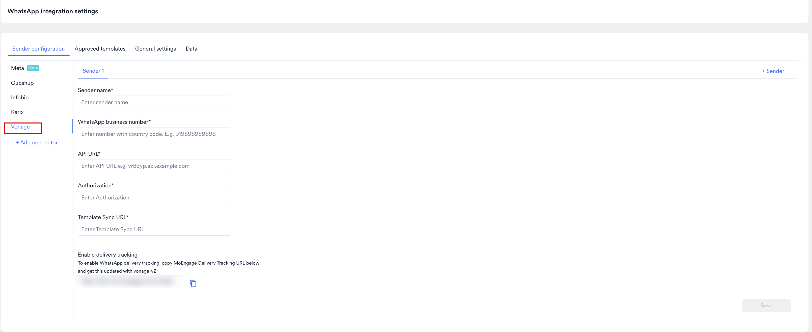

# Introduction

Vonage is a communication platform as a service (CPaaS) provider that helps brands connect with their customers over WhatsApp. The Vonage MoEngage Connector is a self-service, no-code integration built on Vonage Cloud Runtime (VCR), bridging MoEngage's campaign execution layer with Vonage's messaging infrastructure to let you send WhatsApp campaigns at scale directly through Vonage. For more information, refer to Vonage's [WhatsApp Channel User Guide](https://api.support.vonage.com/hc/en-us/articles/29661901573276-MoEngage-Connector-WhatsApp-Channel-Guide).

The connector supports two operating modes: Standalone and Conversational Connect. For the prerequisites and setup steps specific to Conversational Connect mode, refer to Section 2 of the [Vonage WhatsApp Channel Guide](https://api.support.vonage.com/hc/en-us/articles/29661901573276-MoEngage-Connector-WhatsApp-Channel-Guide).

<Info>
  **Prerequisites**

  * Access to your [Vonage Dashboard](https://dashboard.nexmo.com/private/dashboard) to retrieve your API Key.
  * Access to [Vonage Cloud Runtime](https://developer.vonage.com/en/cloud-runtime) to deploy the connector instance.
  * A registered and Meta-approved WhatsApp Business Account (WABA), with your sender number onboarded.
  * Access to your Vonage Dashboard Settings to obtain your Signature secret (Standalone mode only). For Conversational Connect mode, the webhook signature comes from the Conversational Connect Developer Portal instead.
  * Admin access to the MoEngage dashboard, with the WhatsApp channel enabled on your MoEngage tenant.
</Info>

## Sender Configuration

To configure a Sender from Vonage on the MoEngage Dashboard, do the following:

1. Go to **Settings** > **Channels** > **WhatsApp** > **Sender configuration**.
2. Click **+ Add connector** and select **Vonage Connector** from the connector list.
3. Deploy the Vonage Conversations for MoEngage connector on Vonage Cloud Runtime by following Section 3 (Conversational Connect mode, Steps 1 to 8) or Section 4 (Standalone mode, Steps 1 to 5) of the [Vonage WhatsApp Channel Guide](https://api.support.vonage.com/hc/en-us/articles/29661901573276-MoEngage-Connector-WhatsApp-Channel-Guide), then return here to configure the sender.
4. Add the following details:

| Field Name | Description |
| --- | --- |
| Sender name | A recognizable name for this Sender profile, so you can identify it while creating a campaign in MoEngage. |
| WhatsApp business number | The WABA number registered with Vonage, including country code. |
| API URL | Copy this from your Vonage connector admin panel. Perform the steps described in [Step 10: Configure the Sender Profile in MoEngage](https://api.support.vonage.com/hc/en-us/articles/29661901573276-MoEngage-Connector-WhatsApp-Channel-Guide#:~:text=Step%2010%3A%20Configure%20the%20Sender%20Profile%20in%20MoEngage) to retrieve this value. |
| Authorization | Set the value to `Bearer <token>`, replacing `<token>` with the bearer token you generated. Perform the steps described in [Step 9: Generate a Bearer Token for Authentication](https://api.support.vonage.com/hc/en-us/articles/29661901573276-MoEngage-Connector-WhatsApp-Channel-Guide#:~:text=Step%209%3A%20Generate%20a%20Bearer%20Token%20for%20Authentication) to generate this token. |
| Template Sync URL | Copy this from your Vonage connector admin panel, alongside the API URL. |

5. Click **Save** to save this Sender configuration.

<Info>
  You need pre-approved WhatsApp templates to run a WhatsApp campaign for a Vonage sender. After saving the sender, go to **Settings** > **WhatsApp** > **Approved templates** and click **Sync Template** to import them. If a template is not picked up, add it manually with the exact name, language, category, and placeholder structure. For details, including carousel templates in Conversational Connect mode, refer to Section 5.1 of the [Vonage WhatsApp Channel Guide](https://api.support.vonage.com/hc/en-us/articles/29661901573276-MoEngage-Connector-WhatsApp-Channel-Guide).
</Info>

## Enable Delivery Tracking

To enable WhatsApp delivery tracking, copy the **MoEngage Delivery Tracking URL** shown after saving, and update it in your Vonage connector admin panel.

{/* ADD IMAGE HERE: Enable delivery tracking field on the MoEngage dashboard */}

## Next Steps

1. [Create a WhatsApp Campaign](/user-guide/campaigns-and-channels/whatsapp/create/create-a-whatsapp-campaign)
2. [WhatsApp Campaign Analytics](/user-guide/campaigns-and-channels/whatsapp/analyze/analyze-whatsapp-campaign)
3. [Create a report of the campaign's delivery stats and conversion goals](/user-guide/campaigns-and-channels/campaign-management-and-reports/create-ad-hoc-campaign-reports)
